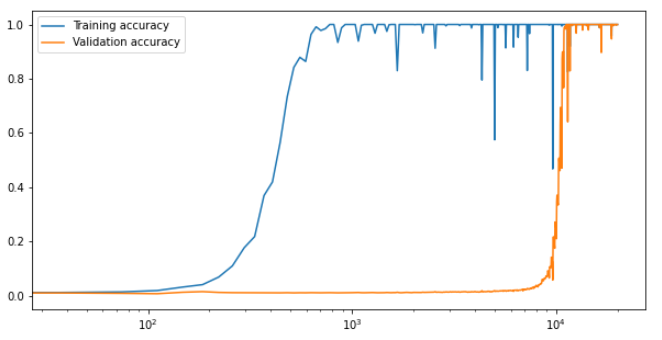
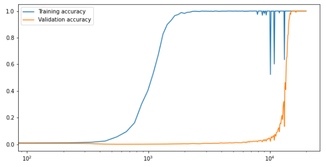

# Grokking
Reproducing experiments from the paper "*Grokking: Generalization beyond Overfitting on small algorithmic datasets*" [[link](https://mathai-iclr.github.io/papers/papers/MATHAI_29_paper.pdf)].

---
This repository mainly focuses on two experiments, division mod 97, and combination of permutations of S5. Most results discussed in the paper are achieved on the S5 dataset, and there is a nice plot with the mod division operator that can be used as a reference when comparing the results. All the hyperparameters are as described in section **A.1.2**. Whenever the value of a hyperparameter was not explicitly stated, it was set to a reasonable value.  

The figure below shows the training and validation accuracy of the model on the division97 table, trained on 30% of the data. It corresponds to *Figure 1 Left* from the paper. The biggest difference seems to be that in this experiment grokking happens approximately an order of magnitude faster (10^4 steps as opposed to 10^5) despite using a smaller portion of the data for training (30% vs 50%). The discrepancy is even bigger when run on equal portions. It is important to point out that the exact hyperparameters of this experiment were not mentioned in the paper, so these are most likely slightly different than those given in the appendix. This can explain the slight difference in performance.

  

The validation accuracy curves however seem to match up. According to the paper *"(...) the number of steps until the train accuracy first reaches 99% generally trends down as dataset size decreases and stays in the range of 10^3-10^4 optimization steps"*. This indeed seems to be the case generally, though rather on the lower end. When training on the division table, 99%< performance is usually reached after about 10^3 optimization steps, or even a bit earlier (similar to *Figure 1 Left*). In the S5 permutation case (given below) the convergence on the training data also seems to be within the range claimed.

  

For this experiment there is no matching figure in the paper, so direct comparison is not possible. However *Figure 2 Left* shows the expected performance on the validation set after 10^5 optimization steps. According to the plot (AdamW, weight decay 1, 30% data) it is supposed to just about reach 100% on the validation set, which again seems to be about order of magnitude slower than what actually happened, but this again might be explained by slight differences in hyperparameters or implementation.  
Overall the experiments turned out to be fairly easily reproducible, giving very similar results to that presented in the paper.

